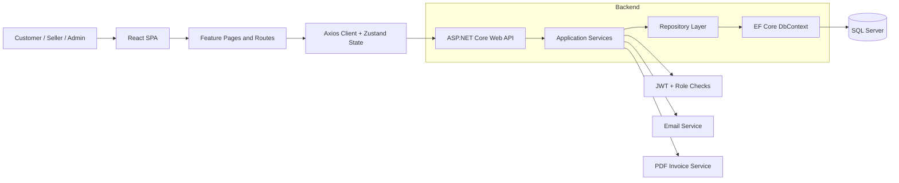

# PrakashMart

[](frontend)
[](backend)
[](docs/DATABASE.md)
[](#testing)

PrakashMart is a full-stack e-commerce platform with a customer storefront, seller workspace, and admin console. The project is built with **React + Vite + TypeScript** on the frontend and **ASP.NET Core Web API** on the backend, with **SQL Server + Entity Framework Core** managing persistence and migrations.

---

## Architecture Overview

PrakashMart follows a layered architecture: the React SPA handles the user experience, the ASP.NET Core API owns business rules and security, and EF Core repositories persist data to SQL Server.



### Key Highlights

- Customer flows for product browsing, wishlist, cart, checkout, orders, returns, wallet usage, and profile management
- Seller flows for product CRUD, variant-aware inventory, analytics, seller orders, and return handling
- Admin flows for user, seller, product, order, category, brand, coupon, and banner management
- JWT-based authentication with role-based authorization
- EF Core migrations and idempotent seed data on backend startup
- Backend email notifications and PDF invoice generation

---

## Tech Stack

| Layer | Technologies |
|---|---|
| **Frontend** | React 18, Vite, TypeScript, Tailwind CSS, Zustand, React Router, Axios |
| **Backend** | .NET 8, ASP.NET Core Web API |
| **Database** | SQL Server, Entity Framework Core |
| **Authentication** | JWT Bearer tokens |
| **Testing** | Vitest (frontend), xUnit + Moq + FluentAssertions (backend) |
| **Other Services** | SMTP email, Razorpay integration hooks, Web Push support |

---

## Repository Structure

```text
PrakashMart/
├── frontend/                         # React + Vite SPA
│   └── src/
│       ├── app/                      # Routing and app bootstrap
│       ├── features/                 # Auth, product, cart, order, seller, admin, wallet, ...
│       └── shared/                   # Layout, UI, hooks, API client, utilities
├── backend/
│   ├── src/
│   │   ├── Domain/                   # Entities and repository contracts
│   │   ├── Application/              # Services, DTOs, validation, interfaces
│   │   ├── Infrastructure/           # EF Core, migrations, repositories, external services
│   │   └── API/                      # Controllers, middleware, configuration, startup
│   └── tests/
│       └── Application.Tests/        # Backend unit tests
├── docs/
│   ├── DATABASE.md                   # Database and migration guide
│   ├── DEPLOYMENT.md                 # Local and Docker setup
│   ├── TECHNICAL.md                  # Technical architecture notes
│   ├── SRS.md                        # Software requirements reference
│   └── DESIGN.md                     # UI and design-system notes
└── README.md
```

---

## Getting Started

### Prerequisites

- [.NET 8 SDK](https://dotnet.microsoft.com/download/dotnet/8.0)
- [Node.js 20+](https://nodejs.org/)
- SQL Server 2019+ or SQL Server Express
- Optional: Docker Desktop

### 1. Clone the Repository

```bash
git clone https://github.com/<your-org>/prakashmart.git
cd prakashmart
```

### 2. Backend Setup

Copy the local development template:

```bash
copy backend\src\API\appsettings.Development.example.json backend\src\API\appsettings.Development.json
```

Update the values in `backend/src/API/appsettings.Development.json` with your local secrets.

Then restore and run the backend:

```bash
cd backend
dotnet restore PrakashMart.sln
dotnet run --project src/API/PrakashMart.API.csproj
```

Backend URLs:

- API: `http://localhost:5001`
- Swagger: `http://localhost:5001/swagger`

### 3. Frontend Setup

```bash
cd frontend
npm install
npm run dev
```

Frontend URL:

- App: `http://localhost:3000`

The frontend proxies `/api` requests to the backend during local development.

---

## Database

PrakashMart uses **SQL Server + EF Core migrations** as the schema source of truth.

- Migrations: `backend/src/Infrastructure/Persistence/Migrations/`
- DbContext: `backend/src/Infrastructure/Persistence/AppDbContext.cs`
- Seed logic: `backend/src/Infrastructure/Persistence/DbSeeder.cs`

Useful commands:

```bash
cd backend
dotnet ef database update --project src/Infrastructure --startup-project src/API
dotnet ef migrations add <MigrationName> --project src/Infrastructure --startup-project src/API
```

The backend also applies pending migrations and seed data automatically on startup.

More detail: [DATABASE.md](/E:/AI_FlipKart/docs/DATABASE.md:1)

---

## Testing

### Frontend

```bash
cd frontend
npm test
```

Verified locally on August 13, 2026:

- `9/9` frontend tests passed
- frontend production build passed with `npm run build`

### Backend

```bash
cd backend
dotnet test tests/Application.Tests/Application.Tests.csproj
```

Note: backend restore/build could not be fully re-verified in this environment because external package access was failing during restore.

---

## Docker Setup

Copy the environment template:

```bash
copy .env.example .env
```

Then start the full stack:

```bash
docker compose up --build
```

Docker URLs:

- Frontend: `http://localhost`
- Backend API: `http://localhost:8080/api/`
- Swagger: `http://localhost:8080/swagger`

Detailed setup steps: [DEPLOYMENT.md](/E:/AI_FlipKart/docs/DEPLOYMENT.md:1)

---

## Secrets and Public Repo Safety

- Do not commit `.env`
- Do not commit `backend/src/API/appsettings.Development.json`
- Use the committed template files instead:
  - `.env.example`
  - `backend/src/API/appsettings.Development.example.json`
- Production secrets should be supplied via environment variables or a secret manager

The repository also includes a root `NuGet.config` that clears machine-specific package feeds and uses `nuget.org` for restore.

---

## Documentation

- [docs/DATABASE.md](/E:/AI_FlipKart/docs/DATABASE.md:1) - migrations, schema flow, seed data
- [docs/DEPLOYMENT.md](/E:/AI_FlipKart/docs/DEPLOYMENT.md:1) - local and Docker setup
- [docs/TECHNICAL.md](/E:/AI_FlipKart/docs/TECHNICAL.md:1) - deeper architecture notes
- [docs/SRS.md](/E:/AI_FlipKart/docs/SRS.md:1) - software requirements reference
- [docs/DESIGN.md](/E:/AI_FlipKart/docs/DESIGN.md:1) - UI and design-system notes

---

## License

Add the license required by the destination public repository before publishing if the source is intended for reuse outside the showcase context.
